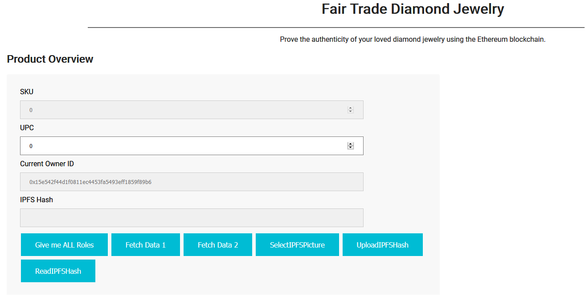
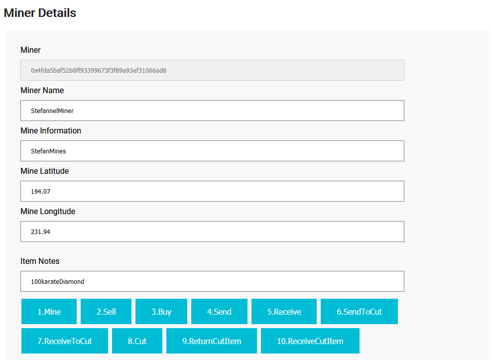
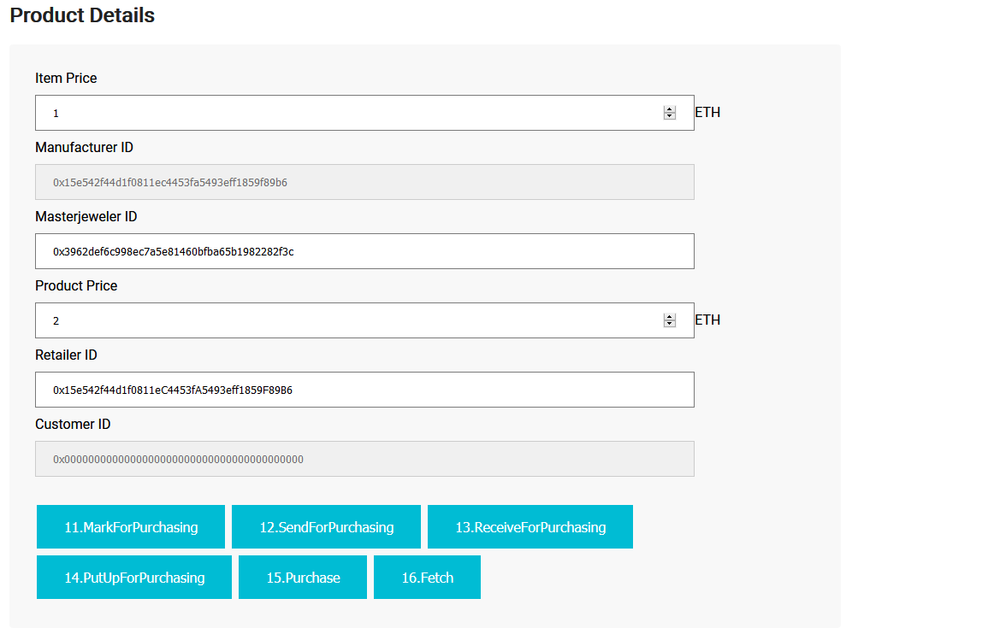
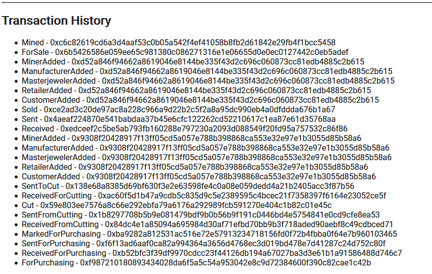
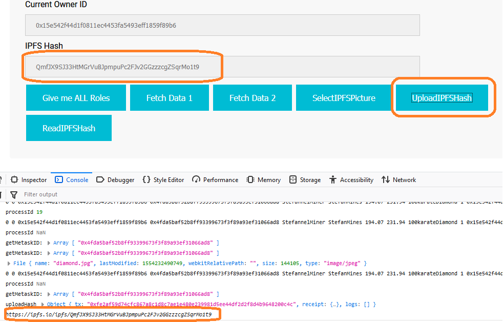

# Project 6: Architect a Blockchain Supply Chain Solution - Part B
 
## Concept and explanation
Sixth project for Blockchain NanoDegree that requires to create a DApp supply chain solution backed by the Ethereum platform. Also requires to architect smart contracts that manage specific user permission controls as well as contracts that track and verify a product’s authenticity.

As source of information, I have used this article: [The complete diamond supply chain from mine to finger](http://www.capetowndiamondmuseum.org/blog/2017/03/the-complete-diamond-supply-chain-from-mine-to-finger/)

This repository contains an Ethereum DApp that demonstrates a Diamond jewelry Supply Chain flow between a miner and final buyer/customer. The user story is similar to any commonly used supply chain process. 

In this scenario, a miner can mine a (raw/uncut) diamond and then sell it. A manufacturer can buy it. The manufacturer then has to sent it to a master jeweler to cut (polish) the diamond and make it suitable for selling it to luxury shops. After the cutting process, the manufacturer will send it to a retailer where it will be displayed and put up for sale. At this stage, a customer can purchase the final diamond (or diamond jewelry). All actors can track the item throughout the supply chain. As a hint, for the steps of [Miner ->Manufacturer ->Masterjeweler] the item is an item which has an itemPrice but once it gets cut/polished, [Manufacturer ->Retailer->Customer] the item can be seen as a product which has a productPrice.

The front-end of the application runs on the client's machine, powered by a lite-server. Using web3/metamask (using infura's endpoints), it communicates with the deployed smart contract from Ethereum Rinkeby Test Network.
It also interacts with IPFS in a very lightweight mode: instead of running a node on client's machine, it uses INFURA's endpoint. As in the case of ethereum, infura has already a ipfs node up and running and provides external services and access to it. The user will upload the image to ipfs via infura node and also save the hash of the file to the blockchain for a unique item.

## Contract Address and transactions (from Rinkeby)
```
Deploying 'MinerRole'
   ---------------------
   > transaction hash:    0x1391bdd736fc6142258115e0848baa10de7a69791de45f39221d1aff5b051846
   > contract address:    0x44Af02c5817D5d2772B4f3C4dC76e8f364afA2B6
Deploying 'ManufacturerRole'
   ----------------------------
   > transaction hash:    0x7b0ffe822972a6d4edcd058c39df2994facdf04821b2d14b2244df69f0d11489
   > contract address:    0x00034293E178D783a94E9e1f17f011B7Add7c956
Deploying 'MasterjewelerRole'
   -----------------------------
   > transaction hash:    0xdc36e2153a7ed653a5b2f3347eab2482d338dd1aaff3455b5449a88cab1b34a1
   > contract address:    0xDef3249c8EbAfFfFd35751B0D17423aaCa22c805   
Deploying 'RetailerRole'
   ------------------------
   > transaction hash:    0xd09a8b12386923ab6e88297ea9e94557790a5eb272996b82e341125aff7d2977
   > contract address:    0x6291812917bfbB069989Cf8a6E964C4ECA02A2Ed
Deploying 'CustomerRole'
   ------------------------
   > transaction hash:    0x3053180f56b9900f20c011ef4758c62110abf3d406e91a8b631e4eae29ba5edb
   > contract address:    0x07fF8602CEb5F519Ff7134eBB34A219F28D7E961   
Deploying 'SupplyChain'
   -----------------------
   > transaction hash:    0x92873e537c189cd99184dc273a51029b4109a93a2a5acf6e320f844afc28ee3e
   > contract address:    0x9EfA6AdEA6C970b2a696EDbc7E15787b457ba0e3   
```
## GUI Overview










## GUI Explanation (also contains info about how to use the APP)

### 1.Product Overview
#### 1.1 Fields
- `SKU` Is generated automatically by the system. Starts with 0 and increments as more items are added
- `UPC` is the id of the item the miner can mine or actors can track via `Fetch Data 1` and `Fetch Data 2`. It is manually given by the miner
- `Current Owner ID` - the address of the current owner which owns the item. Miner when the item is mined, manufacturer when the item gets bought, sent to cut, displayed and customer when item gets purchased
- `IPFS Hash` the IPFS hash of the image associated with the item. An image can be added only by original miner by using "SelectIPFSPicture" and "UploadIPFSHash"
#### 1.2 Buttons
- `Give me ALL Roles` The Supplychain.sol contract implements the MinerRole, ManufacturerRole, MasterjewelerRole, RetailerRole, CustomerRole, thus has a strict role access policy: only the contract owner OR another Role can add another role. For the purpose of testing, this I have modified the contract to allow any user to add all 5 roles to the current metamask address by using this button
- `Fetch Data 1` & `Fetch Data 2` - allows to fetch the data/description for the current UPC item from `upc` field.  Also, as a bonus, the retrieved data also gets put into the Product Details/Miner Details input text forms.
- `SelectIPFSPicture` open a file explorer/uploader and allows the original miner to select a picture to be hashed and uploaded to IPFS via Infura
- `UploadIPFSHash` starts the process of hashing and uploading to IPFS via Infura. Also, is will call the smartContract to save the hash for the given UPC onto the blockchain. Only Miner is allowed.
- `ReadIPFSHash` fetches the current's `upc` item ipfs hash from the blockchain and displays it on the `IPFS Hash` field and also on the console.
 
### 2. Miner Details
#### 2.1 Fields
- `Miner` The address of the miner. Gets populated after `1.Mine` and `Fetch Data 1 /2`.
- `Miner Name` The name of the miner who mined the item. Required to be inserted before a new item is mined.
- `Mine Information` - Information of the miner who mined the item. Required to be inserted before a new item is mined.
- `Mine Latitude` Mine Latitude.
- `Mine Longitude` Mine Longitude.
- `Item Notes` Item Notes.
#### 2.2 Buttons
- `1.Mine` [From Miner] Attempts to mine a new item identified by the inserted `upc`. It will not mine if the current account is NOT a MinerRole. Make sure you click on `Give me ALL Roles` button to grant all 5 roles to the current metamask account. Also, does not mine if the `upc` item id already exists
- `2.Sell` [From Miner] Allows to sell the `upc` item for the given `item price`. Will not work if the current Metamask account is NOT the original miner of the `upc` id item.
- `3. Buy` [From Manufacturer] Allows a manufacturer to buy the item if the sent value is > `item price`. Requires the caller to be a Manufacturer role. (`Give me ALL Roles` will grant the current account all 5 roles!)
- `4.Send` [From Miner] The miner sends the item to the manufacturer. Will only work if the current metamask account is the original miner.
- `5. Receive` [From Manufacturer] The manufacturer/buyer of the given upc marks the item as received.
- `6.SendToCut` [From Manufacturer to Masterjeweler] NEEDS to input a `Masterjeweler ID` address. Will not work if the input `masterjeweler id` is not a MasterjewelerRole (`Give me ALL Roles` button should have already granted all 5 roles to the current metamask account)
- `7.ReceiveToCut` [From Masterjeweler] the masterjeweler receives the `upc` item to cut
- `8.Cut` [From Masterjeweler] Masterjeweler cuts the item/diamond
- `9.Return cut item` [From Masterjeweler] The authorized masterjeweler returns the item
- `10.ReceiveCutItem` [From Manufacturer] allows the authorized manufacturer to receive the item.
 
### 3. Product Details
#### 3.1 Fields
- `Item Price` The item price for which the miner wants to put the raw diamond/item for sale.
- `Manufacturer ID` The address of the user who bought the raw diamond from the miner.
- `Masterjeweler ID` - The address to which the manufacturer has sent the diamond to be cut.
- `Product price` The price for which the manufacturer can SELL the cut diamond to the end customer. As a default value, the itemPrice (uncut diamond) is 1 ETH and productPrice (cut/polished diamond)is 2 ETH. This value is read when the manufacturer uses the `11.MarkForPurchasing`
- `Retailer ID` The address to which the manufacturer will `12.SendForPurchasing` cut diamond to be displayed and put up for purchasing towards the final customers.
- `Customer ID` The address of the end customer who will purchase the final diamond that was put up for sale by the retailer. 
#### 3.2 Buttons
- `11.MarkForPurchasing` [From Manufacturer] Allows the manufacturer to mark the item ready for purchasing by giving it a resale price (productPrice).
- `12.SendForPurchasing` [From Manufacturer to Retailer] Sends the `upc` item (product) to the `Retailer ID` to be displayed and put up for sale. Requires that the `Retailer ID` address is a RetailerRole (should be if `Give me ALL Roles` button has been used)
- `13.ReceiveForPurchasing` [From Retailer] The authorized retailer (the current metamask account) attempts to mark the `upc` item as received 
- `14.PutUpForPurchasing` [From Retailer] The authorized retailer marks the `upc` item as being displayed where customers can view and purchase.
- `15.Purchase` [From Customer] Purchases the `upc` item. The current metamask account needs to be a customer role (should be if `Give me ALL Roles` button has been used)
- `16.Fetch` [From Customer] Marks the item as fetched (taken out of the shop). Needs that the current metamask account is the customer who previously purchased the item.

### 4. Transaction History
The app listent to any successful events and displays them

### IPFS Upload Image Hash
The original miner can upload a picture to IPFS (it used Infura) and the image's hash will be saved onto the blockchain as well. The console display the ipfs link to the hash image.

## Using the APP
### Intro tips
- Due to Role Access Restrictions, before doing any action, the current metamask account has to have that role. Using `Give me ALL Roles` button will give the current MM account all 5 roles and can easily test the entire app in a go. For a more elaborate check, you can have 5 accounts (and use `Give me ALL Roles` on all 5) and Mine with account0, buy with account1, cut with account2, retail with account3 and purchase with account4. I have tested this app this way, but with only 4 accounts.
- Item UPC 0 has already been reserved/mined/tested by the current contract owner.
- Please also enable the console as it logs useful info.
- `UploadIPFSHash` is pretty slow as it 1.uploads to ipfs and 2.sends the hash to the deployed smart contract. It takes ~ 1 minute.
### Using the app
0. Please use `Give me ALL Roles` to allow the current MetaMask account to receive MinerRole (and all other roles) and mine an item. 
1. `1.Mine` Please make sure you filled in info in `upc`, `MinerName`, `MineInformation`, `MaineLat/Long`, `Item Notes`. One you mine and `Fetch data 1/2` the fields `Miner` and `Owner` will be populated with the original miner's address. 
1.1 As the item is mined, you can continue with `2,3,4,5,6...` OR you can `SelectIPFSFile` and `UploadIPFSFile`. Uploading can be done at any stage only by original miner, once the item has been mined
2. `2.Sell` The original miner tries to sell the product for the `item Price`.
3. `3.Buy` A manufacturer attempts to buy the `upc item`. A pupup screen will ask to input how much the buyer wants to send. The current account has to be a ManufacturerRole
4. `4.Send` Original Miner sends the item to the manufacturer that just bought it from him.
5. `5.Receive` The manufacturer that just bought the item marks it as received
6. `6.SendToCut` You have to input an address on the `Masterjeweler ID`. that address will be verified if it is a MasterjewlerRole.
7. `7.ReceiveToCut` the current account attempts to mark the item as received. Will revert if the current account is not the authorized masterjeweler to whom the manufacturer sent the item to.
8. `8.Cut` The current account attempts to mark the item as cut.Will revert if the current account is not the authorized masterjeweler to whom the manufacturer sent the item to.
9. `9.ReturnCutItem` The current account attempts to mark the item as ReturnCutItemcut.Will revert if the current account is not the authorized masterjeweler to whom the manufacturer sent the item to.
10. `10.ReceiveCutItem` The current account attempts to mark the item as cut.Will revert if the current account is not the authorized manufacturer who initially bought the item.
11. `11.MarkForPurchasing` The current account attempts to mark the item for purchasing. Please fill in a `productPrice`.
12. `12.SendForPurchasing` Please input a `Retailer ID` address in the input box. The current account attempts to send the item to the `Retailer ID`. WIll not work if that address if not a RetailerRole
13. `13.ReceiveForPurchasing` The current MM account attempts to mark the item as received. Will revert if the current MM account is not the retailer to who the item has been sent to in step #12.
14. `14.PutUpForPurchasing` Retailer puts the item for display and up for purchase in the luxury shops
15. `15.Purchase` The current account attempts to purchase the item. The current account has to be a CustomerRole. A popup window will ask how much ether to send in order to purchase the item.
16. `16.Fetch` The current account attempts to fetch the item from the shop. It will only work if the current account is the customer who just bought the item (step #15)
## Getting Started
These instructions will get you a copy of the project up and running on your local machine for development and testing purposes. 

### Prerequisites

* [NodeJS](https://nodejs.org/en/download/current/) (The install will also include the npm node package manager)
* [ganache-cli](https://github.com/trufflesuite/ganache-cli) Fast Ethereum RPC client for testing and development
* [truffle](https://www.npmjs.com/package/truffle) Development environment, testing framework and asset pipeline for Ethereum
* MetaMask extension installed in your browser and few ethers on Rinkeby Test Network.
```
node -v
npm -v
npm i ganache-cli -g
npm i truffle -g
```

### Installing

A step by step series of examples that tell you have to get a development env running

Clone this repository:

```
git clone https://github.com/StefanelStan/P6.git
```

Change directory to `P6` folder and install all requisite npm packages (as listed in `package.json`):

```
cd P6
npm install
```
Launch Ganache:

```
ganache-cli -l 10000000
```

Your terminal should look something like this:


In a separate terminal window, Compile smart contracts:

```
truffle compile
```

This will create the smart contract artifacts in folder ```build\contracts```.

Migrate smart contracts to the locally running blockchain, ganache-cli:

```
truffle migrate
```
## Running the tests
```
npm run truffletest
```

All 118 tests should pass. Note: It might be possible for some tests to fail due to a ganache error (err net revert). If this happens, please restart ganache-cli and run `npm run truffletest` again


## Launching the APP
In a separate terminal window, launch the DApp: the a new browser window will open displaying the app. Please accept for the app to access the metamask.
```
npm run dev
```
As a side note, truffle.js uses a mnemonic and infurakey in order to deploy to rinkeby. These two are put in config/mnemonic.txt and config/infurakey.txt. I have blanked them and replaced with dummy test. You will need to have your own mnemonics and infuraKey to redeploy to rinkeby. This is not a required step, but I only mention about them.


## Built With
```
Truffle v5.0.8 (core: 5.0.8)
Solidity - 0.5.2 (solc-js)
Node v10.15.3
Web3.js v1.0.0-beta.37
```
### Testing libraries
* [Chai](https://www.npmjs.com/package/chai)- BDD / TDD assertion library for node. It provides easy to read asserts and expects as well at matchers (greater, between, before, contains etc)
* [Mocha](https://www.npmjs.com/package/mocha) - Simple, flexible, fun JavaScript test framework for Node.js 
* [truffle-assertions](https://www.npmjs.com/package/truffle-assertions) - Additional assertions and utilities for testing Ethereum smart contracts in Truffle unit tests. Used to listen for events
* [lite-server](https://www.npmjs.com/search?q=lite-server) - Lightweight development node server for serving a web app. Used to kickstart the http server to deploy the html and js to interract with the dapp.

### Development Libraries and Tools
* [Ethereum](https://www.ethereum.org/) - Ethereum is a decentralized platform that runs smart contracts. The SupplyChain contract is deployed on Rinkeby Test Network
* [IPFS](https://ipfs.io/) - IPFS is the Distributed Web | A peer-to-peer hypermedia protocol. The Miner can upload a picture to IPFS and its hash is saved on blockchain
* [Truffle Framework](http://truffleframework.com/) - Truffle is the most popular development framework for Ethereum with a mission to make your life a whole lot easier. Used for development and testing.
* [ganache-cli](https://www.npmjs.com/package/ganache-cli) Ganache CLI, part of the Truffle suite of Ethereum development tools, is the command line version of Ganache. Used to kickstart a a evm and personal blockchain to deploy and test the contract locally.
* [web3js](https://www.npmjs.com/package/web3) Ethereum JavaScript API.
* [truffle-hdwallet-provider](https://www.npmjs.com/package/truffle-hdwallet-provider) - HD Wallet-enabled Web3 provider. Use it to sign transactions for addresses. Used in truffle.cmd for deployment of contracts
* [Visual Studio Code](https://code.visualstudio.com/) - Web editor


## Authors

* **Stefanel Stan** - [Stefanel Stan Github](https://github.com/StefanelStan)

## Special Thanks
* Author wishes to thank Infura and Stackoverflow for providing great free services and to the three online resources listed below for sharing their helpful knowledge
* https://medium.freecodecamp.org/hands-on-get-started-with-infura-and-ipfs-on-ethereum-b63635142af0	
* https://codepen.io/itsthomas/pen/wFrDm
* https://medium.com/@angellopozo/uploading-an-image-to-ipfs-e1f65f039da4

## License

This project is licensed under the MIT License 
